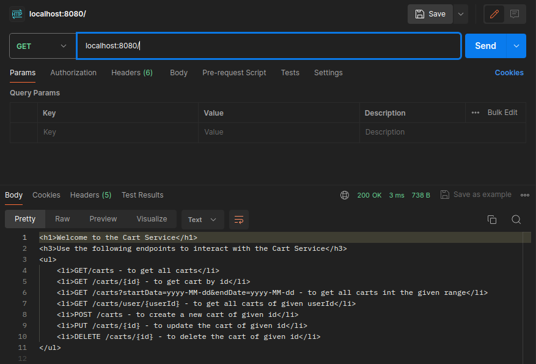

# Cart Service API

#### This is a simple Proxy Server for a cart service implemented using the FakeStoreAPI.

#### The Implemented Api is RESTful and has the following endpoints:

1. **GET**/
    

&nbsp;

2. **GET** /carts - Get all carts
    

&nbsp;

3. **GET** /carts/:id - Get a cart by id
    

&nbsp;

4. **GET** /carts?startdata={Date}&enddate={Date} - Get all carts between a date range
    

&nbsp;

5. **GET** /carts/user/:id - Get all carts by user id
    

&nbsp;

6. **POST** /carts - Create a new cart
    

&nbsp;

7. **PUT** /carts/:id - Update a cart by id
    

&nbsp;

8. **DELETE** /carts/:id - Delete a cart by id
    

&nbsp;
